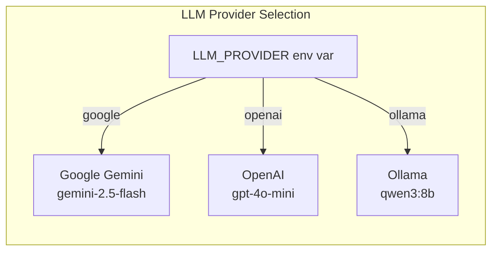

# AI Orchestration - Genkit Flows and Prompts

## Genkit Setup

Genkit is Google's AI orchestration framework. MAESTRO uses it to define structured AI flows with input/output schemas.

### Provider Configuration (`src/ai/genkit.ts`)

```typescript
// Provider selection via environment variable
const provider = process.env.LLM_PROVIDER ?? 'google';

// Dynamic plugin + model configuration
switch (provider) {
    case 'openai':
        config.plugins = [openAI({apiKey: process.env.OPENAI_API_KEY})];
        config.model = `openai/${process.env.LLM_MODEL || 'gpt-4o-mini'}`;
        break;
    case 'ollama':
        config.plugins = [ollama({ ... })];
        config.model = `ollama/${process.env.LLM_MODEL || 'qwen3:8b'}`;
        break;
    default:
        config.plugins = [googleAI()];
        config.model = `googleai/${process.env.LLM_MODEL || 'gemini-2.5-flash'}`;
}

export const ai = genkit(config);
```



## Flow Architecture

Each AI flow follows the same pattern:

```
Input Schema (Zod) → Prompt Template → Genkit Flow → Output Schema (Zod)
```

### Flow 1: suggestThreatsForLayer

**File:** `src/ai/flows/suggest-threats-for-layer.ts`

```typescript
// Input Schema
interface SuggestThreatsForLayerInput {
    architecturedescription: string;    // System architecture description
    layerName: string;                 // MAESTRO layer name
    layerDescription: string;          // Layer description
}

// Output Schema
interface SuggestThreatsForLayerOutput {
    threatAnalysis: string;  // Markdown-formatted threat analysis
}
```

**Prompt Template:**
```text
You are a security analyst specializing in identifying potential 
security vulnerabilities in multi-agent systems...

System Architecture Description:
{{{architecturedescription}}}

MAESTRO Layer to Analyze: {{layerName}}
Layer Description: {{{layerDescription}}}

Agentic Factors to Consider:
- Non-Determinism
- Autonomy
- No Trust Boundary  
- Dynamic Identity and Access Control
- Agent to Agent interactions, delegations, and communication complexity

Instructions:
1. Analyze the provided system architecture
2. Generate threat analysis in two categories:
   - Category 1: Traditional Threats
   - Category 2: Agentic Threats
3. Format as Markdown
```

### Flow 2: recommendMitigations

**File:** `src/ai/flows/recommend-mitigations.ts`

```typescript
// Input Schema
interface RecommendMitigationsInput {
    threatDescription: string;  // From Flow 1 output
    layer: string;             // MAESTRO layer name
}

// Output Schema
interface RecommendMitigationsOutput {
    recommendation: string;    // Mitigation strategy
    reasoning: string;         // Why this strategy
    caveats: string;          // Limitations
}
```

**Prompt Template:**
```text
You are a cybersecurity expert providing mitigation strategies 
for identified threats in a MAESTRO architecture.

For the threat described below, provide:
1. recommendation 
2. reasoning
3. caveats or limitations

Threat Description: {{{threatDescription}}}
MAESTRO Layer: {{{layer}}}
```

### Flow 3: generateExecutiveSummary

**File:** `src/ai/flows/generate-executive-summary.ts`

```typescript
// Input Schema (aggregates all layer analysis)
interface GenerateExecutiveSummaryInput {
    architecturedescription: string;
    analysisResults: {
        id: string;
        name: string;
        description: string;
        threat: string | null;
        mitigation: {
            recommendation: string;
            reasoning: string;
            caveats: string;
        } | null;
        status: "pending" | "analyzing" | "complete" | "error";
    }[];
}

// Output Schema
interface GenerateExecutiveSummaryOutput {
    summary: string;  // Markdown executive summary
}
```

**Prompt Template:**
```text
You are a principal security analyst. Your task is to write 
a high-level executive summary...

The summary should:
1. Briefly acknowledge the analyzed architecture
2. Highlight the most critical threats identified
3. Mention key mitigation themes
4. Conclude with defense-in-depth strategy statement
5. Be concise, professional
6. Format as Markdown
7. Include MAESTRO framework link

Analyzed Architecture:
{{{architecturedescription}}}

Analysis Results:
{{#each analysisResults}}
---
Layer: {{name}}
Status: {{status}}
{{/each}}
```

### Flow 4: generateArchitectureDiagram

**File:** `src/ai/flows/generate-architecture-diagram.ts`

```typescript
// Input Schema
interface GenerateArchitectureDiagramInput {
    architecturedescription: string;
}

// Output Schema  
interface GenerateArchitectureDiagramOutput {
    mermaidCode: string;  // Mermaid.js syntax in code block
}
```

**Prompt Template:**
```text
You are an expert in system architecture and Mermaid syntax.

Instructions:
1. Generate a graph TD (Top-Down) diagram
2. Keep syntax simple - use node IDs and labels
3. Use simple arrow connectors like --> 
4. DO NOT use parentheses, brackets, or special chars in labels
5. Represent key components and relationships
6. Output ONLY the Mermaid code in a code block

System Description:
{{{architecturedescription}}}
```

## Schema Generation with Zod

All schemas are defined using Zod and exported for type safety:

```typescript
const SuggestThreatsForLayerInputSchema = z.object({
    architecturedescription: z.string().describe('...'),
    layerName: z.string().describe('...'),
    layerDescription: z.string().describe('...'),
});

export type SuggestThreatsForLayerInput = z.infer<typeof SuggestThreatsForLayerInputSchema>;
```

### Schema Characteristics

| Schema | Purpose |
|--------|---------|
| Input Schemas | Validate user input, provide AI context |
| Output Schemas | Enforce structured AI responses |
| Types | Exported for TypeScript usage in server actions |

## Flow Registration

Flows are imported in `src/ai/dev.ts` for Genkit dev server registration:

```typescript
import '@/ai/flows/recommend-mitigations.ts';
import '@/ai/flows/suggest-threats-for-layer.ts';
import '@/ai/flows/generate-executive-summary.ts'; 
import '@/ai/flows/generate-architecture-diagram.ts';
```

## Prompt Engineering Notes

### Key Patterns Used

1. **Role Assignment** - "You are a security analyst..."
2. **Structured Output** - Explicit instructions for formatting
3. **Multi-shot Context** - Providing architecture + layer details
4. **Agentic Context** - Reminding AI about MAESTRO-specific factors

### Template Variables

Genkit uses triple-brace `{{{` for HTML-safe interpolation:
- `{{{architecturedescription}}}` - User's architecture text
- `{{layerName}}` - Simple variable
- `{{#each analysisResults}}` - Loop helper

### Output Cleaning

The Mermaid diagram flow strips markdown code fences:

```typescript
const mermaidCode = output.mermaidCode
    .replace(/````mermaid\n|```/g, '')
    .trim();
```

## Cost Considerations

Each analysis requires:
- **7 layers** × **2 calls/layer** = **14 LLM calls**
- **+1 executive summary** = **15 total calls**
- **+1 diagram** (optional) = **up to 16 calls**

Estimated costs (Gemini 2.5 Flash):
- ~$0.002 per call (varies by token count)
- ~$0.03-0.05 per complete analysis