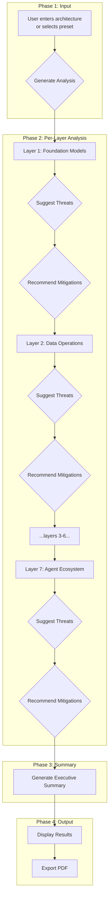

# Analysis Pipeline - Step-by-Step Threat Analysis Process

## Pipeline Architecture

The threat analysis pipeline processes each of the 7 MAESTRO layers sequentially, performing two AI calls per layer, followed by an executive summary generation.



## Step-by-Step Execution

### Phase 1: Input

```typescript
// User provides architecture description through:
// 1. Free-form text input in SidebarInputForm
// 2. Preset selection from 10 built-in use cases

interface SidebarInputProps {
    onAnalyze: (architectureDescription: string) => void;
    onStop: () => void;
    isAnalyzing: boolean;
    buttonText: string;
}
```

### Phase 2: Sequential Layer Analysis

Each layer goes through a two-step analysis:

```
Layer N ───────┬─────────────────────────
               │
               ├─► Step A: suggestThreatsForLayer
               │   ├─ Input: { architecturedescription, layerName, layerDescription }
               │   ├─ Flow: Genkit prompt → LLM → structured output
               │   └─ Output: { threatAnalysis: string (markdown) }
               │
               └─► Step B: recommendMitigations
                   ├─ Input: { threatDescription, layer }
                   ├─ Flow: Genkit prompt → LLM → structured output
                   └─ Output: { recommendation, reasoning, caveats }
```

#### Detailed Flow with State Transitions

```mermaid
stateDiagram-v2
    [*] --> Pending
    Pending --> Analyzing: User clicks "Generate"
    Analyzing --> Complete: AI returns results
    Analyzing --> Error: AI call fails
    Complete --> [*]: All 7 layers done
    
    state "Loop per layer" {
        Pending --> Analyzing: updateLayerStatus(id, "analyzing")
        Analyzing --> ThreatReceived: suggestThreat() resolve
        ThreatReceived --> MitAnalyzing: recommendMitigation()
        MitAnalyzing --> Complete: set status "complete"
        MitAnalyzing --> Error: catch block
    }
```

### Phase 3: Executive Summary

After all layers complete, an executive summary is generated:

```typescript
interface ExecutiveSummaryInput {
    architecturedescription: string;       // Original description
    analysisResults: LayerData[];          // All 7 layer results
}

interface ExecutiveSummaryOutput {
    summary: string;  // Markdown-formatted summary
}
```

## Data Structures

### LayerData Type

```typescript
interface LayerData {
    id: string;                    // "foundation-models"
    name: string;                  // "Foundation Models" 
    description: string;           // Layer description
    threat: string | null;         // AI-generated threat markdown
    mitigation: {
        recommendation: string;    // What to do
        reasoning: string;         // Why do it
        caveats: string;          // Limitations
    } | null;
    status: "pending" | "analyzing" | "complete" | "error";
}
```

### Example Layer State Progression

```javascript
// Initial state
{
    id: "foundation-models",
    name: "Foundation Models",
    description: "Core AI models and language models...",
    threat: null,
    mitigation: null,
    status: "pending"
}

// After suggestThreat
{
    // ...
    threat: "# Foundation Model Threats\n\n## Traditional Threats\n- Model poisoning...\n## Agentic Threats\n- Autonomy risks...",
    status: "analyzing"
}

// After recommendMitigation
{
    // ...
    threat: "...", // same as above
    mitigation: {
        recommendation: "Implement adversarial training...",
        reasoning: "Foundation models are vulnerable to...",
        caveats: "Requires significant compute resources..."
    },
    status: "complete"
}
```

## Real-World Example: Foundation Models Layer

### Step 1: Prompt Construction

```
System Architecture Description:
A multi-agent customer support system with three layers:
1. Foundation models (GPT-4, Anthropic Claude)
2. Data operations with Pinecone vector store
3. Agent frameworks using LangChain

MAESTRO Layer to Analyze: Foundation Models
Layer Description: Core AI models and language models

Agentic Factors to Consider:
- Non-Determinism
- Autonomy 
- No Trust Boundary
- Dynamic Identity and Access Control
- Agent to Agent interactions, delegations, and communication complexity
```

### Step 2: AI Response Structure (Threat)

```markdown
# Foundation Model Threats

## Traditional Threats
- Model poisoning through fine-tuning data manipulation
- Prompt injection attacks
- Data leakage through training data memorization

## Agentic Threats
- **Autonomy**: Agents may autonomously use poisoned models
- **Non-Determinism**: Unpredictable outputs create attack surface
- **No Trust Boundary**: Models shared across agent trust boundaries
```

### Step 3: Mitigation Prompt

```
Threat Description: [above threat markdown]
MAESTRO Layer: Foundation Models

Provide:
- Recommendation
- Reasoning  
- Caveats
```

### Step 4: AI Response Structure (Mitigation)

```json
{
    "recommendation": "Implement model output validation with safety filters. Use adversarial training and continuous monitoring of model behavior.",
    "reasoning": "These techniques directly address prompt injection and model poisoning by detecting and filtering malicious patterns before they propagate through the agent system.",
    "caveats": "Safety filtering adds latency. May reduce model capability for edge cases. Requires ongoing maintenance as attack patterns evolve."
}
```

## Progress Logging

Each step produces console-style log entries:

```
> Starting MAESTRO threat analysis...
> [Foundation Models] Analysis started...
> [Foundation Models] Calling AI to suggest threats...
> [Foundation Models] Threat analysis received.
> [Foundation Models] Calling AI for mitigation strategies...
> [Foundation Models] Mitigation recommendation received.
> [Foundation Models] Analysis complete.
> [Data Operations] Analysis started...
> ... (repeats for each layer)
> Generating executive summary...
> Executive summary generated.
> Full analysis complete.
```

## Cancellation Pattern

The pipeline supports mid-analysis cancellation using a `useRef` flag:

```typescript
const analysisCancelledRef = useRef(false);

const handleStop = () => {
    analysisCancelledRef.current = true;
    addLog("Analysis stop requested. Finishing current step...");
};

// Inside the async handler:
for (const layer of MAESTRO_LAYERS) {
    if (analysisCancelledRef.current) {
        addLog(`Analysis stopped by user.`);
        break;
    }
    // ... rest of analysis
}
```

## Next Steps

- See **[AI Orchestration](./ai-orchestration.md)** for prompt templates
- See **[Error Handling](./error-handling.md)** for failure recovery patterns