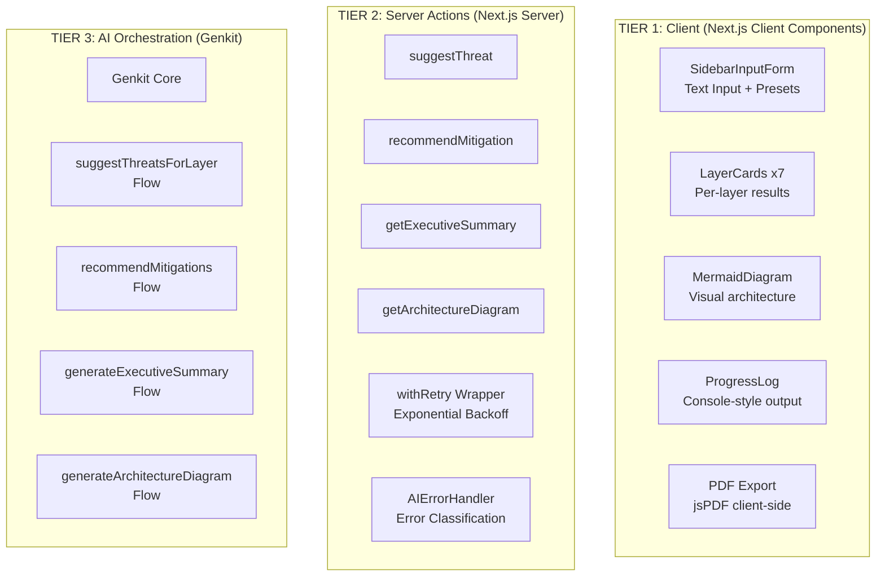
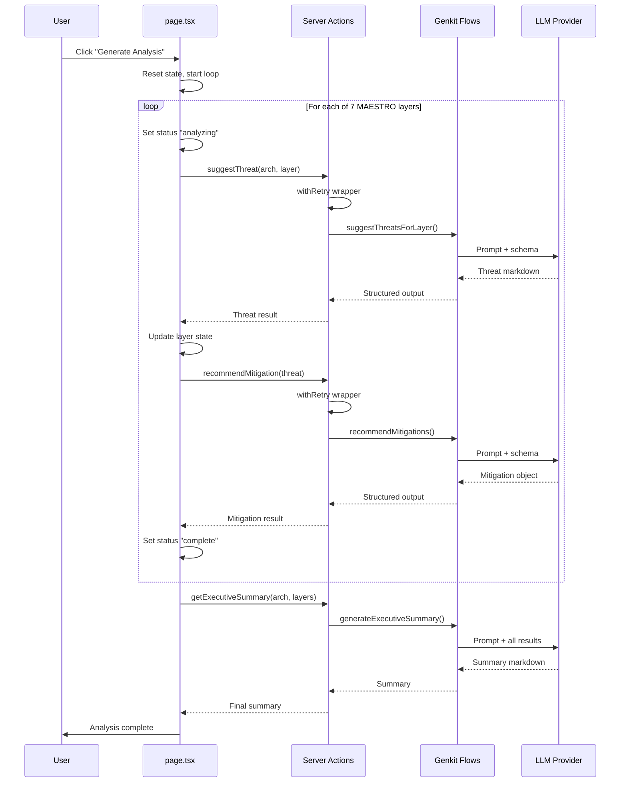
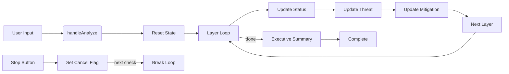
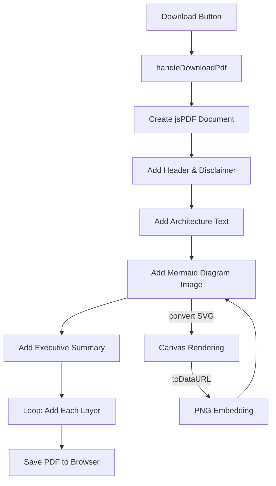

# Architecture Flow - Detailed System Architecture

## High-Level Architecture

MAESTRO follows a **three-tier architecture**: Client UI → Server Actions → AI Orchestration.



## Data Flow: Threat Analysis



## State Management

The main `page.tsx` component uses a set of React hooks to manage all application state:

```typescript
interface AppState {
    // Analysis state
    layers: LayerData[];           // 7 layer objects with status
    isAnalyzing: boolean;          // Global analyzing lock
    buttonText: string;           // Dynamic button label
    
    // Content state
    currentArchitecture: string;   // User's architecture text
    executiveSummary: string|null; // Final summary markdown
    mermaidCode: string;          // Generated diagram code
    
    // UI state
    logs: string[];              // Progress log entries
    isDownloading: boolean;       // PDF download lock
    isGeneratingDiagram: boolean; // Diagram generation lock
    
    // Refs (persistent across renders)
    analysisCancelledRef: MutableRefObject<boolean>;
    logsContainerRef: RefObject<HTMLDivElement>;
    diagramContainerRef: RefObject<HTMLDivElement>;
}
```

### State Update Flow



## Server Action Architecture

Each server action in `actions.ts` follows this pattern:

```typescript
// Example: suggestThreat
export async function suggestThreat(
    architecturedescription: string,
    layerName: string,
    layerDescription: string
): Promise<SuggestThreatsForLayerOutput> {
    
    return withRetry(async () => {
        try {
            const result = await suggestThreatsForLayer({
                architecturedescription,
                layerName,
                layerDescription,
            });
            return result;
        } catch (error) {
            // Transform raw error → MaestroError
            const maestroError = AIErrorHandler.handleAIFlowError(
                error, 
                'suggestThreatsForLayer',
                { context: data }
            );
            throw maestroError;
        }
    }, undefined, (error) => {
        // Retry predicate
        if (error instanceof Error && error.message.includes('MaestroError')) {
            const maestroError = JSON.parse(...);
            return AIErrorHandler.shouldRetry(maestroError);
        }
        return true;
    });
}
```

## Configuration Environment Variables

```bash
# .env.example
LLM_PROVIDER=google    # or openai, ollama
LLM_MODEL=gemini-2.5-flash  # default model
OPENAI_API_KEY=        # if using OpenAI
OLLAMA_SERVER_ADDRESS=http://localhost:11434  # if using Ollama
```

Provider selection happens in `src/ai/genkit.ts`:

```typescript
switch (provider) {
    case 'openai':
        config.plugins = [openAI({apiKey: process.env.OPENAI_API_KEY})];
        config.model = `openai/${process.env.LLM_MODEL || 'gpt-4o-mini'}`;
        break;
    case 'ollama':
        config.plugins = [ollama({
            serverAddress: process.env.OLLAMA_SERVER_ADDRESS,
            models: [{name: process.env.LLM_MODEL, type: 'generate'}]
        })];
        config.model = `ollama/${process.env.LLM_MODEL}`;
        break;
    default: // google
        config.plugins = [googleAI()];
        config.model = `googleai/${process.env.LLM_MODEL || 'gemini-2.5-flash'}`;
}
```

## PDF Generation Pipeline

PDF generation happens entirely client-side using jsPDF:

