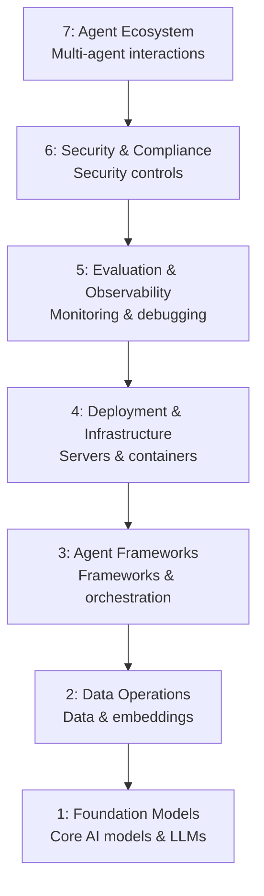

# MAESTRO Threat Analyzer - Overview

## What is MAESTRO?

**MAESTRO Threat Analyzer** is an AI-powered threat modeling tool designed specifically for **Agentic AI systems**. It analyzes system architectures across **7 MAESTRO framework layers** and generates comprehensive threat assessments with AI-driven mitigation recommendations.

The tool is built on the [MAESTRO framework](https://cloudsecurityalliance.org/blog/2025/02/06/agentic-ai-threat-modeling-framework-maestro) by the Cloud Security Alliance, which provides a structured seven-layer approach to systematically analyze and mitigate security risks in multi-agent systems.

## Core Features

- **7-Layer Threat Analysis** - Analyzes architectures across all MAESTRO framework layers
- **AI-Powered** - Uses LLMs to generate threat assessments and mitigation strategies
- **Architecture Diagram Generation** - Converts text descriptions into visual Mermaid diagrams
- **Executive Summary** - Produces high-level summaries for leadership audiences
- **PDF Export** - Downloads complete analysis reports as PDF documents
- **Multi-Provider Support** - Google Gemini, OpenAI, or Ollama as AI backends

## Tech Stack

| Layer | Technology |
|-------|-----------|
| Framework | Next.js 15 (App Router, Turbopack) |
| Language | TypeScript (strict mode) |
| AI Orchestration | Genkit AI Framework |
| UI Components | shadcn/ui + Radix UI + Tailwind CSS |
| State | React hooks (useState, useRef) |
| Validation | Zod schemas |
| Serialization | jsPDF (client-side PDF) |
| Diagramming | Mermaid.js |
| Testing | Vitest + React Testing Library + jsdom |

## MAESTRO 7-Layer Framework



## Project Structure

```
src/
├── ai/                          # Genkit AI orchestration
│   ├── genkit.ts               # LLM provider configuration
│   ├── dev.ts                  # Dev server entry point
│   └── flows/                  # AI workflow definitions
│       ├── suggest-threats-for-layer.ts
│       ├── recommend-mitigations.ts
│       ├── generate-executive-summary.ts
│       └── generate-architecture-diagram.ts
├── app/                        # Next.js App Router
│   ├── layout.tsx              # Root layout with providers
│   ├── page.tsx                # Main application page
│   └── actions.ts              # Server actions (bridge → AI)
├── components/                 # React components
│   ├── error-boundary.tsx
│   ├── icons.tsx
│   ├── layer-card.tsx
│   ├── mermaid-diagram.tsx
│   ├── sidebar-input-form.tsx
│   └── ui/                     # shadcn/ui library
├── data/                       # Static data
│   ├── maestro.ts             # 7 MAESTRO layer definitions
│   └── use-cases.ts           # 10 preset use cases
├── lib/                        # Utilities
│   ├── ai-error-handler.ts    # Error classification
│   ├── errors.ts             # MaestroError class
│   ├── retry-utils.ts        # Exponential backoff
│   ├── types.ts             # TypeScript type definitions
│   └── utils.ts             # cn() class merger
└── test/                      # Test utilities
```

## Architecture Overview

```mermaid
graph TD
    subgraph Client
        UI[UI Components<br/>LayerCard / Sidebar / PDF]
        State[React State<br/>layers / logs / summary]
    end

    subgraph Server Actions
        SA[actions.ts<br/>withRetry wrapper]
    end

    subgraph AI Layer
        GEN[Genkit Framework]
        F1[suggestThreatsForLayer]
        F2[recommendMitigations]
        F3[generateExecutiveSummary]
        F4[generateArchitectureDiagram]
    end

    subgraph LLM Providers
        G[Google Gemini]
        O[OpenAI]
        L[Ollama Local]
    end

    UI -->|analyze| State
    State -->|invoke| SA
    SA -->|orchestrate| GEN
    GEN -->|prompt| F1
    GEN -->|prompt| F2
    GEN -->|prompt| F3
    GEN -->|prompt| F4
    F1 -->|model call| G
    F2 -->|model call| G
    F3 -->|model call| G
    F4 -->|model call| G
    F1 -. also -. O
    F2 -. also -. O
    GEN -. alternative -. L
    GEN -. alternative -. O
```

## Quick Start

```bash
# Install dependencies
npm install

# Configure environment
cp .env.example .env
# Set: LLM_PROVIDER=google (or openai/ollama)
# Set: API keys for chosen provider

# Run development server
npm run dev

# Access the app
# http://localhost:3000
```

## Next Steps

See individual documentation files for:
- **[Architecture Flow](./architecture-flow.md)** - Detailed system architecture and data flow
- **[Analysis Pipeline](./analysis-pipeline.md)** - Step-by-step threat analysis process
- **[AI Orchestration](./ai-orchestration.md)** - Genkit flows and prompts
- **[Error Handling](./error-handling.md)** - Error classification and retry strategy
- **[UI Components](./ui-components.md)** - Component library and design system
- **[Testing](./testing.md)** - Test setup and examples